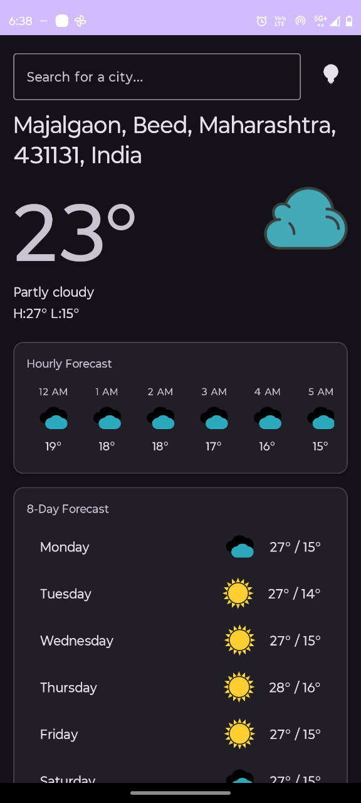
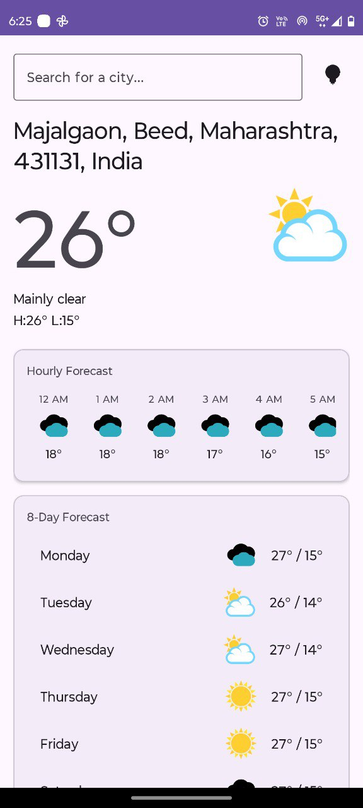
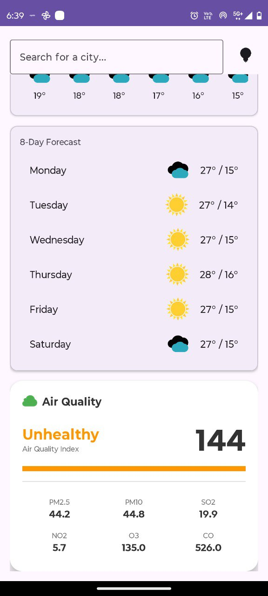
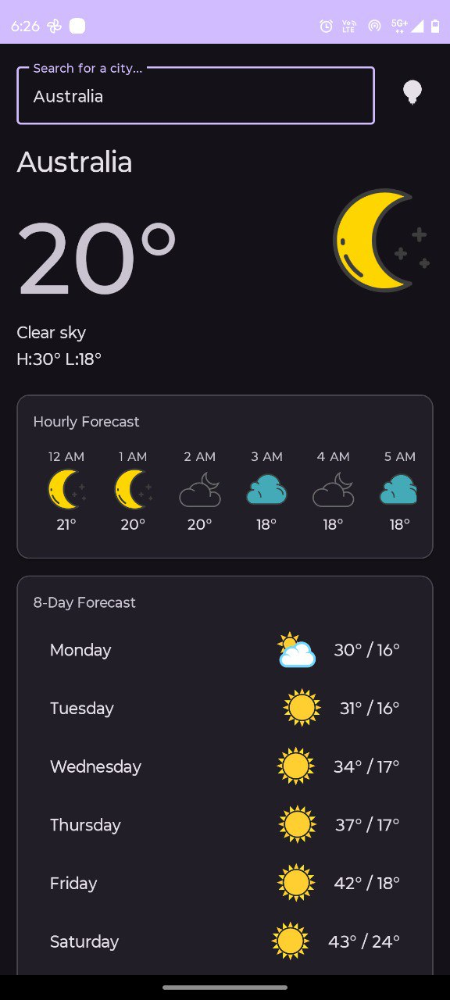

# MyWeatherApp 🌦️

A modern, native Android weather application built with **Kotlin** that provides real-time weather updates, accurate forecasts, and detailed air quality data for any location on Earth.

Built with a clean **MVVM architecture**, this app offers a seamless user experience with support for both Light and Dark themes.

---

## 📱 Screenshots

| **Dark Mode** | **Light Mode** |
|:---:|:---:|
|  |  |
| *Dark Theme Interface* | *Light Theme Interface* |

| **Air Quality Dashboard** | **City Search** |
|:---:|:---:|
|  |  |
| *Detailed Air Quality Metrics* | *Global Location Search* |

---

## ✨ Key Features

* **📍 Automatic Location Detection:** Instantly fetches weather data for your current location upon granting permission.
* **🌍 Global Search:** Search for any city or region worldwide to check its current weather conditions.
* **💨 Air Quality Index (AQI):** A dedicated dashboard showing the US AQI score along with detailed pollutants (PM2.5, PM10, SO2, NO2, O3, CO).
* **📅 8-Day Forecast:** Plan your week with a comprehensive daily weather outlook.
* **⏰ Hourly Updates:** Scroll through a detailed hourly forecast for the current day.
* **🌗 Theme Support:** Fully supported Light and Dark modes that adapt to system settings or user preference.
* **🔒 Privacy Focused:** Does not store user location data permanently; only uses it for fetching real-time data.

---

## 🛠️ Tech Stack & Architecture

* **Language:** Kotlin
* **Architecture:** MVVM (Model-View-ViewModel)
* **UI Components:** XML Layouts, ViewBinding, Material Design 3
* **Networking:** Retrofit2 & Gson
* **Asynchronous Programming:** Coroutines & LiveData
* **Location Services:** Android LocationManager
* **Build Tool:** Gradle (Kotlin DSL)

---

## ☁️ APIs Used

This project relies on free and open-source APIs (**No API Keys required** for basic setup!):

1.  **[Open-Meteo Weather API](https://open-meteo.com/):** For fetching current weather, hourly, and daily forecasts.
2.  **[Open-Meteo Air Quality API](https://open-meteo.com/en/docs/air-quality-api):** For fetching real-time Air Quality Index and pollutant data.
3.  **[Nominatim (OpenStreetMap)](https://nominatim.org/):** For Geocoding (converting city names to coordinates) and Reverse Geocoding.

---

## 🚀 Getting Started

To run this project locally on your machine:

1.  **Clone the repository:**
    ```bash
    git clone [https://github.com/ghodkevrushabh/my-weather-app.git](https://github.com/ghodkevrushabh/my-weather-app.git)
    ```

2.  **Open in Android Studio:**
    * Launch Android Studio.
    * Select "Open" and navigate to the cloned folder.

3.  **Sync Gradle:**
    * Allow Android Studio to download dependencies and sync the project.

4.  **Run the App:**
    * Connect an Android device or start an Emulator.
    * Click the **Run (▶️)** button.

---

## 🤝 Contributing

Contributions are welcome! If you have suggestions for new features or improvements:

1.  Fork the project.
2.  Create your feature branch (`git checkout -b feature/AmazingFeature`).
3.  Commit your changes (`git commit -m 'Add some AmazingFeature'`).
4.  Push to the branch (`git push origin feature/AmazingFeature`).
5.  Open a Pull Request.

---
